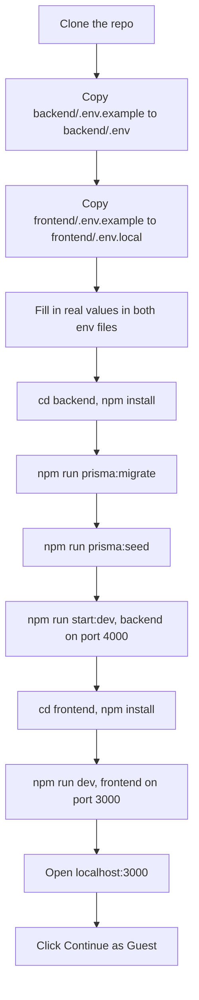

# Flowboard

A task and project board built for the AbleSpace Full Stack Developer (Fresher) technical assessment. Create projects, add tasks with a status and priority, drag them across a Kanban board or work from a list view, break tasks into subtasks, comment on them, and filter the list/board by status or priority.

This repo is Part 1 (the build). Part 2 is the product-understanding submission, not written yet. It'll be linked here once it exists, either as a `PART2.md` in this repo or a Google Doc/video link.

## Live demo

- App: https://flowboard-zeta-eight.vercel.app
- API: https://flowboard-api-9074.onrender.com (health check at `/health`)

Click "Continue as Guest" on the login page. There's no real account system: guest login always resolves to the same shared demo user, so profile edits on the Settings page are local to your browser session and don't persist. Google login is a disabled stub, not wired up (see architecture.md's Known Deviations for why).

## Tech stack

Frontend is Next.js 16 (App Router), React 19, TypeScript, and Tailwind CSS v4. State is plain React (`useState`/`useEffect`) plus `fetch`, no Redux or React Query. Board drag-and-drop uses `@dnd-kit`, dropdowns and menus use Radix UI, dates use `date-fns` and `react-day-picker`. Light/dark mode and an independent accent-color setting both run through `next-themes` plus a small custom provider, persisted to `localStorage`.

Backend is NestJS 11, TypeScript, Prisma 6 as the ORM, PostgreSQL as the database. Auth is a JWT in an `httpOnly` cookie, checked by a global guard on every route except the ones explicitly marked `@Public()`. Every write goes through a `class-validator` DTO before it reaches Prisma.

Frontend deploys to Vercel, backend to Render (via `render.yaml`), database is Neon's serverless Postgres. `architecture.md` has the reasoning behind each of those choices, plus the full data model and API reference.

## Setup

You need Node.js (18 or newer) and a Postgres database. Neon's free tier works fine, or run Postgres locally.



### 1. Clone and configure the backend

```bash
git clone https://github.com/MohammadAnas-07/flowboard.git
cd flowboard/backend
cp .env.example .env
```

Open `.env` and fill in:
- `DATABASE_URL`: a real Postgres connection string. No Postgres handy? Create a free [Neon](https://neon.tech) project and copy its connection string.
- `JWT_SECRET`: any long random string, e.g. the output of `openssl rand -base64 32`.
- `CORS_ORIGIN`: leave as `http://localhost:3000` for local dev, that's the frontend's default port.
- Leave `PORT` and the commented-out `NODE_ENV` line alone. `.env.example` explains what `NODE_ENV` does and why not to set it locally.

### 2. Install backend dependencies and set up the database

```bash
npm install
```
Also runs `prisma generate` (the `postinstall` script), which generates the Prisma Client from `schema.prisma`. This needs `DATABASE_URL` to be present in `.env`, not necessarily reachable yet. If it fails here, check for a typo or a missing `.env` file rather than a connectivity problem.

```bash
npm run prisma:migrate
```
Applies every migration in `prisma/migrations`, creating all the tables. If this fails, confirm `DATABASE_URL` is actually reachable (`psql "$DATABASE_URL"` or your client of choice), and if you're on Neon, confirm the project isn't paused. Neon's free tier suspends after inactivity and needs a moment to wake up on the first connection.

```bash
npm run prisma:seed
```
Seeds the five default labels (Research, Design, Development, Testing, Deployment). Safe to re-run, it upserts rather than duplicating.

### 3. Start the backend

```bash
npm run start:dev
```
Starts the NestJS server on `http://localhost:4000` with hot reload. Confirm it's up with `curl http://localhost:4000/health`, should return `{"status":"ok"}`. Leave this running and open a new terminal for the frontend.

### 4. Configure and start the frontend

```bash
cd flowboard/frontend
cp .env.example .env.local
npm install
npm run dev
```
`NEXT_PUBLIC_API_URL` in `.env.local` already defaults to `http://localhost:4000`, matching the backend's default port, no edit needed unless you changed `PORT` in the backend's `.env`. Starts the frontend on `http://localhost:3000`.

### 5. Log in

Open `http://localhost:3000` and click "Continue as Guest." If the button does nothing or errors, check the backend terminal for a CORS rejection and confirm `CORS_ORIGIN` in `backend/.env` includes `http://localhost:3000`.

## Running tests

Backend only, frontend has no test suite (see architecture.md's Known Limitations).

```bash
cd backend
npm test        # unit tests: DTO validation, AuthGuard
npm run test:e2e  # single e2e smoke test against a real Nest app instance
```

Most of the suite is real: `class-validator` DTO tests for `CreateTaskDto` (accepts valid payloads, rejects bad enums/UUIDs/dates), and `AuthGuard` tests covering the public-route bypass, missing cookie, invalid JWT, and deleted-user cases, with `JwtService`/`PrismaService` mocked so nothing touches a real database. `app.controller.spec.ts` and `test/app.e2e-spec.ts` are still the two files `nest generate` scaffolds by default, testing the placeholder root route rather than anything Flowboard-specific, left in place since they still pass and cost nothing to keep.

## Folder structure

Real tree of the tracked repo, `node_modules`/build output excluded:

```
├── backend
│   ├── prisma
│   │   ├── migrations
│   │   │   ├── 20260808051618_init_schema
│   │   │   │   └── migration.sql
│   │   │   ├── 20260808060434_add_subtask_assignees
│   │   │   │   └── migration.sql
│   │   │   ├── 20260808090709_add_task_activity_and_resource_url
│   │   │   │   └── migration.sql
│   │   │   └── migration_lock.toml
│   │   ├── schema.prisma
│   │   └── seed.ts
│   ├── src
│   │   ├── auth
│   │   │   ├── decorators
│   │   │   │   └── current-user.decorator.ts
│   │   │   ├── guards
│   │   │   │   ├── auth.guard.spec.ts
│   │   │   │   └── auth.guard.ts
│   │   │   ├── auth.controller.ts
│   │   │   ├── auth.module.ts
│   │   │   ├── auth.service.ts
│   │   │   └── auth.types.ts
│   │   ├── comments
│   │   │   ├── dto
│   │   │   │   └── create-comment.dto.ts
│   │   │   ├── comments.controller.ts
│   │   │   ├── comments.module.ts
│   │   │   └── comments.service.ts
│   │   ├── common
│   │   │   └── decorators
│   │   │       └── public.decorator.ts
│   │   ├── labels
│   │   │   ├── dto
│   │   │   │   ├── create-label.dto.ts
│   │   │   │   └── update-label.dto.ts
│   │   │   ├── labels.controller.ts
│   │   │   ├── labels.module.ts
│   │   │   └── labels.service.ts
│   │   ├── prisma
│   │   │   ├── prisma.module.ts
│   │   │   └── prisma.service.ts
│   │   ├── projects
│   │   │   ├── dto
│   │   │   │   ├── create-project.dto.ts
│   │   │   │   └── update-project.dto.ts
│   │   │   ├── projects.controller.ts
│   │   │   ├── projects.module.ts
│   │   │   └── projects.service.ts
│   │   ├── subtasks
│   │   │   ├── dto
│   │   │   │   ├── create-subtask.dto.ts
│   │   │   │   └── update-subtask.dto.ts
│   │   │   ├── subtasks.controller.ts
│   │   │   ├── subtasks.module.ts
│   │   │   └── subtasks.service.ts
│   │   ├── tasks
│   │   │   ├── dto
│   │   │   │   ├── create-task.dto.spec.ts
│   │   │   │   ├── create-task.dto.ts
│   │   │   │   ├── move-task-status.dto.ts
│   │   │   │   ├── query-task.dto.ts
│   │   │   │   └── update-task.dto.ts
│   │   │   ├── tasks.controller.ts
│   │   │   ├── tasks.module.ts
│   │   │   └── tasks.service.ts
│   │   ├── app.controller.spec.ts
│   │   ├── app.controller.ts
│   │   ├── app.module.ts
│   │   ├── app.service.ts
│   │   └── main.ts
│   ├── test
│   │   ├── app.e2e-spec.ts
│   │   └── jest-e2e.json
│   └── (config: .env.example, package.json, tsconfig*.json, nest-cli.json, eslint.config.mjs, .prettierrc)
├── frontend
│   ├── public
│   │   └── (svg icons)
│   ├── src
│   │   ├── app
│   │   │   ├── (app)                      # main authenticated shell: sidebar + these routes
│   │   │   │   ├── projects
│   │   │   │   │   ├── [id]/page.tsx
│   │   │   │   │   └── page.tsx
│   │   │   │   ├── tasks
│   │   │   │   │   ├── [taskId]/page.tsx
│   │   │   │   │   └── page.tsx
│   │   │   │   └── layout.tsx             # auth gate + Sidebar
│   │   │   ├── (settings)
│   │   │   │   └── settings/page.tsx      # own nav, no main sidebar (see below)
│   │   │   ├── login/page.tsx
│   │   │   ├── globals.css
│   │   │   ├── layout.tsx                 # root layout, theme init scripts
│   │   │   └── page.tsx
│   │   ├── components
│   │   │   ├── layout                     # sidebar, theming, user menu
│   │   │   ├── settings                   # settings page view
│   │   │   ├── shared                     # data table, dropdowns, used by more than one feature
│   │   │   ├── tasks                      # board, list, task detail pieces
│   │   │   └── ui                         # avatar, badge
│   │   ├── lib
│   │   │   ├── api.ts                     # client-side fetch wrappers
│   │   │   ├── auth-server.ts             # server-side auth check
│   │   │   ├── constants.ts
│   │   │   ├── theme.ts
│   │   │   └── types.ts                   # mirrors backend/prisma/schema.prisma
│   │   └── proxy.ts                       # Next 16's middleware, redirect-only auth check
│   └── (config: .env.example, package.json, tsconfig.json, next.config.ts, eslint.config.mjs, postcss.config.mjs)
├── architecture.md
├── LICENSE
├── README.md
└── render.yaml
```

`backend/src` is organized by feature module (`tasks`, `projects`, `subtasks`, `comments`, `labels`, `auth`), each with its own controller, service, and DTOs, the structure `nest generate` produces. `frontend/src/app` uses two route groups: `(app)` is the authenticated shell with the main sidebar, `(settings)` is the standalone settings page, split out so it can have its own "Back to app" nav instead of inheriting the main one. `frontend/src/components/shared` holds the pieces reused across features (the data table backs the task list, project list, and subtasks table; the dropdown primitives back the Fields filter, label picker, and status/priority pickers), rather than each feature building its own copy.

See [architecture.md](architecture.md) for the data model, the full API reference, and the deviations from the original Figma design.

## License

MIT, see [LICENSE](LICENSE).
