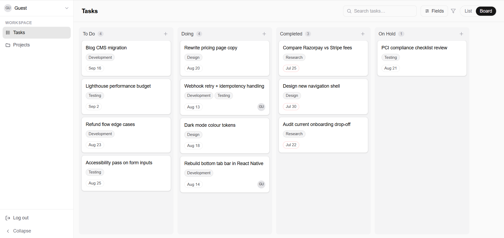
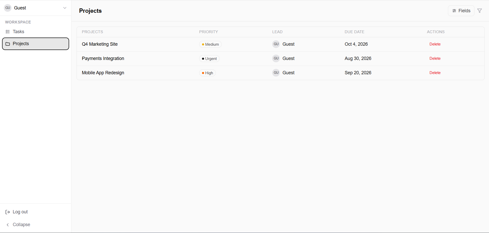
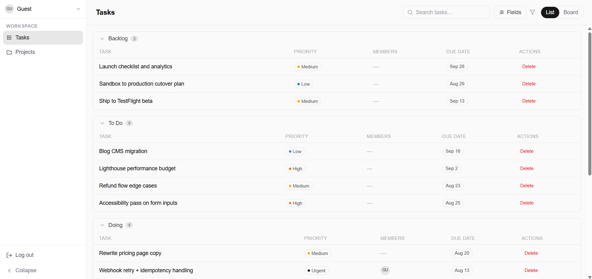
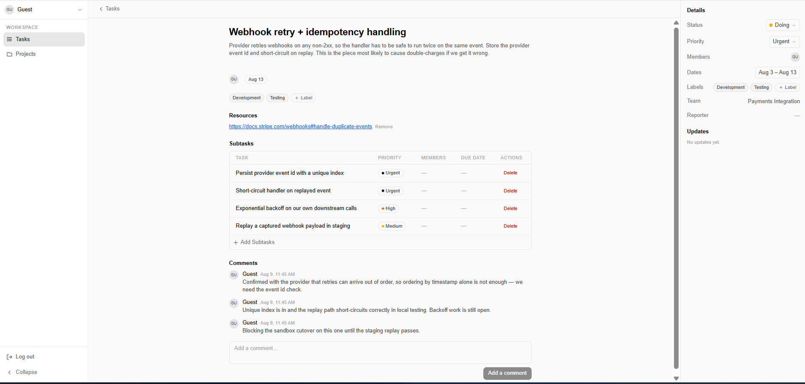
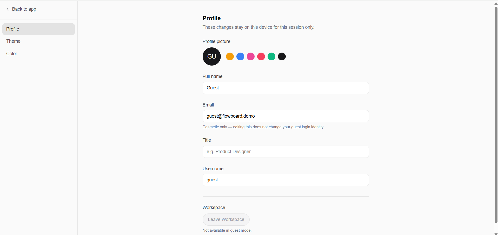
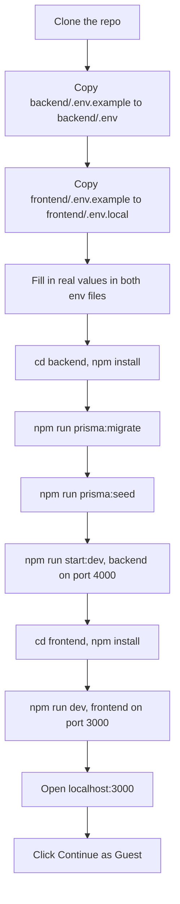

# Flowboard

[](https://github.com/MohammadAnas-07/flowboard/actions/workflows/ci.yml)
[](https://flowboard-zeta-eight.vercel.app)
[](LICENSE)


A task and project board built for the AbleSpace Full Stack Developer (Fresher) technical assessment. Create projects, add tasks with a status and priority, drag them across a Kanban board or work from a list view, break tasks into subtasks, comment on them, and filter the list/board by status or priority.

This repo is Part 1 (the build). Part 2 is the product-understanding submission, not written yet. It'll be linked here once it exists, either as a `PART2.md` in this repo or a Google Doc/video link.

## Live demo

- App: https://flowboard-zeta-eight.vercel.app
- API: https://flowboard-api-9074.onrender.com (health check at `/health`)

Click "Continue as Guest" on the login page. There's no real account system: guest login always resolves to the same shared demo user, so profile edits on the Settings page are local to your browser session and don't persist. Google login is a disabled stub. [Known limitations](#known-limitations) covers both, and the rest of the boundaries.

The backend runs on Render's free tier, which sleeps when idle. If the first load hangs, give it 30 to 60 seconds to cold-start.

## Screenshots

Taken against the deployed app with the shared guest account, so what's shown here is what you get by clicking "Continue as Guest" on the live demo.

**Board view** — tasks grouped by status, dragged between columns with `@dnd-kit`. The move persists on drop, so a refresh keeps the new column. Backlog has no column by design — backlog tasks exist before the board and show up in the list view instead ([architecture.md](architecture.md) Section 7).



**Projects** — every project with its priority, lead and due date, plus how far along its tasks are.



**Task list** — the same tasks as a filterable table. Status and priority filters combine rather than replace each other.



**Task detail** — description, due dates, labels, assignees, subtasks with their own status, and a comment thread.



**Settings** — profile and appearance, with separate Theme and Color tabs. Guest mode says plainly which fields are cosmetic instead of pretending the edits persist.



## Tech stack

Frontend is Next.js 16 (App Router), React 19, TypeScript, and Tailwind CSS v4. State is plain React (`useState`/`useEffect`) plus `fetch`, no Redux or React Query. Board drag-and-drop uses `@dnd-kit`, dropdowns and menus use Radix UI, dates use `date-fns` and `react-day-picker`. Light/dark mode and an independent accent-color setting both run through `next-themes` plus a small custom provider, persisted to `localStorage`.

Backend is NestJS 11, TypeScript, Prisma 6 as the ORM, PostgreSQL as the database. Auth is a JWT in an `httpOnly` cookie, checked by a global guard on every route except the ones explicitly marked `@Public()`. Every write goes through a `class-validator` DTO before it reaches Prisma.

Frontend deploys to Vercel, backend to Render (via `render.yaml`), database is Neon's serverless Postgres. `architecture.md` has the reasoning behind each of those choices, plus the full data model and API reference.

## What's built

Shipped and working end to end against the deployed database:

- [x] Guest auth: JWT in an `httpOnly` cookie, verified by a global guard on every route that isn't explicitly marked public
- [x] Project CRUD, including a per-project task view grouped by status
- [x] Task CRUD, with status, priority, dates, labels, assignees, and a resource link
- [x] Drag-and-drop Kanban board, optimistic on drop with rollback if the API call fails
- [x] List view grouped by status, with per-column visibility toggles and Status/Priority row filtering from the same Fields dropdown
- [x] Task detail page: inline title/description editing, label picker, subtasks table, comments thread, and an activity log fed by server-side change tracking
- [x] Two independent theme axes, light/dark and a six-option accent color, both persisted and both applied before first paint so there's no flash
- [x] Session-local settings page with its own nav, separate from the main app shell
- [x] Responsive layouts at phone, tablet, and desktop widths, including a hamburger drawer sidebar and table-to-card switching
- [x] Backend unit tests for DTO validation and the auth guard
- [x] GitHub Actions CI on every push and PR: lint for both packages, backend unit and e2e tests against a throwaway Postgres service container, and a frontend production build
- [x] A branch ruleset on `main` requiring that CI check to pass, and blocking force pushes and branch deletion

Deliberately out of scope for the 14-day window, in rough order of what I'd pick up first:

- [ ] Real Google OAuth, replacing the disabled stub button
- [ ] Persisted per-user accounts, which is the unlock for real assignees, per-user settings, and anything multi-user
- [ ] Automated frontend tests
- [ ] Real-time collaboration, so two open tabs stay in sync without a reload

## Known limitations

The boundaries here are chosen, not accidental. Each one has a reason:

- **Google login is a disabled stub**, not wired to real OAuth. The button is in the UI to match the Figma, with `aria-disabled` and no click handler. Guest login is the only working auth path, and it's fully tested.
- **One shared guest account, not real multi-user.** Every visitor to the live demo reads and writes the same tasks, projects, and comments. Assignees always resolve to that single demo user because there's no second account to assign anything to.
- **Settings profile edits are session-local.** Avatar, name, email, title, and username live in component state and never reach the backend. With a single shared guest row, persisting them would leak one visitor's edits into another's session. Theme and accent color are the exception: those persist to `localStorage` because they're device-local display preferences, not identity.
- **The funnel icon next to "Fields" is decorative.** The source Figma defines no click behavior or panel for it, so it's drawn to match the design but is inert: `aria-hidden`, no handler, no pointer events. Filtering lives in the Fields button next to it, which is the real control.
- **"Reporter" always renders as a dash.** It's offered as a list column and shown in the task Details sidebar to match the Figma, but `Task` has no `reporter`/`createdBy` field. Showing the gap beat silently dropping the field. Same story for "Team", which falls back to the task's project name since there's no `Team` model.
- **Render's free tier sleeps after inactivity**, so the first request following an idle period takes roughly 30 to 60 seconds while the backend cold-starts. Everything after that is normal speed. That's the hosting tier, not the app.
- **Filters and column visibility reset on reload.** Both are plain component state. The Figma gives no indication they should survive a refresh, and there's no per-user record to store them against anyway.
- **No file upload.** A task's Resources row takes a URL, and avatars are initials on a color you pick. There's no storage bucket in the stack.
- **No realtime sync and no pagination.** Two open tabs won't see each other's changes until one reloads, and `GET /api/tasks` and `GET /api/projects` return everything. Both are fine at demo data volumes and would need work before they weren't.
- **Test coverage is narrow by design.** Backend DTO validation and the auth guard are covered, since they're pure logic and the actual validation and security boundary. Services, controllers, and the whole frontend were verified by hand instead, feature by feature, against a live database and a per-branch preview deploy.

## Setup

You need Node.js (18 or newer) and a Postgres database. Neon's free tier works fine, or run Postgres locally.



### 1. Clone and configure the backend

```bash
git clone https://github.com/MohammadAnas-07/flowboard.git
cd flowboard/backend
cp .env.example .env
```

Open `.env` and fill in:
- `DATABASE_URL`: a real Postgres connection string. No Postgres handy? Create a free [Neon](https://neon.tech) project and copy its connection string.
- `JWT_SECRET`: any long random string, e.g. the output of `openssl rand -base64 32`.
- `CORS_ORIGIN`: leave as `http://localhost:3000` for local dev, that's the frontend's default port.
- Leave `PORT` and the commented-out `NODE_ENV` line alone. `.env.example` explains what `NODE_ENV` does and why not to set it locally.

### 2. Install backend dependencies and set up the database

```bash
npm install
```
Also runs `prisma generate` (the `postinstall` script), which generates the Prisma Client from `schema.prisma`. This needs `DATABASE_URL` to be present in `.env`, not necessarily reachable yet. If it fails here, check for a typo or a missing `.env` file rather than a connectivity problem.

```bash
npm run prisma:migrate
```
Applies every migration in `prisma/migrations`, creating all the tables. If this fails, confirm `DATABASE_URL` is actually reachable (`psql "$DATABASE_URL"` or your client of choice), and if you're on Neon, confirm the project isn't paused. Neon's free tier suspends after inactivity and needs a moment to wake up on the first connection.

```bash
npm run prisma:seed
```
Seeds the five default labels (Research, Design, Development, Testing, Deployment). Safe to re-run, it upserts rather than duplicating.

### 3. Start the backend

```bash
npm run start:dev
```
Starts the NestJS server on `http://localhost:4000` with hot reload. Confirm it's up with `curl http://localhost:4000/health`, should return `{"status":"ok"}`. Leave this running and open a new terminal for the frontend.

### 4. Configure and start the frontend

```bash
cd flowboard/frontend
cp .env.example .env.local
npm install
npm run dev
```
`NEXT_PUBLIC_API_URL` in `.env.local` already defaults to `http://localhost:4000`, matching the backend's default port, no edit needed unless you changed `PORT` in the backend's `.env`. Starts the frontend on `http://localhost:3000`.

### 5. Log in

Open `http://localhost:3000` and click "Continue as Guest." If the button does nothing or errors, check the backend terminal for a CORS rejection and confirm `CORS_ORIGIN` in `backend/.env` includes `http://localhost:3000`.

## Running tests

Backend only, frontend has no test suite (see architecture.md's Known Limitations).

```bash
cd backend
npm test        # unit tests: DTO validation, AuthGuard
npm run test:e2e  # single e2e smoke test against a real Nest app instance
```

Most of the suite is real: `class-validator` DTO tests for `CreateTaskDto` (accepts valid payloads, rejects bad enums/UUIDs/dates), and `AuthGuard` tests covering the public-route bypass, missing cookie, invalid JWT, and deleted-user cases, with `JwtService`/`PrismaService` mocked so nothing touches a real database. `app.controller.spec.ts` and `test/app.e2e-spec.ts` are still the two files `nest generate` scaffolds by default, testing the placeholder root route rather than anything Flowboard-specific, left in place since they still pass and cost nothing to keep.

## API reference

Every route is prefixed `/api` except the two public root routes. "Cookie" in the Auth column means the request needs a valid `flowboard_session` cookie, enforced by a global guard. Full request/response detail is in [architecture.md](architecture.md).

| Method | Path | Description | Auth |
|--------|------|-------------|------|
| GET | `/` | Hello-world root route | Public |
| GET | `/health` | Health check, used by Render | Public |
| POST | `/api/auth/guest` | Find-or-create the demo user, set session cookie | Public |
| POST | `/api/auth/logout` | Clear the session cookie | Public |
| GET | `/api/auth/me` | Current user from the session cookie | Cookie |
| GET | `/api/projects` | List projects | Cookie |
| POST | `/api/projects` | Create project | Cookie |
| GET | `/api/projects/:id` | Get one project | Cookie |
| PATCH | `/api/projects/:id` | Update project | Cookie |
| DELETE | `/api/projects/:id` | Delete project, its tasks survive as unassigned | Cookie |
| GET | `/api/projects/:id/tasks` | Tasks for a project, grouped by status | Cookie |
| POST | `/api/projects/:id/tasks` | Create a task under a project | Cookie |
| GET | `/api/tasks` | List tasks, filterable by `projectId`, `assigneeId`, `status`, `priority` | Cookie |
| POST | `/api/tasks` | Create task, `projectId` optional | Cookie |
| GET | `/api/tasks/:id` | One task with project, assignees, labels, subtasks, comments | Cookie |
| PATCH | `/api/tasks/:id` | Update task, full edit surface | Cookie |
| PATCH | `/api/tasks/:id/status` | Move task to a new status, minimal payload for board drag-and-drop | Cookie |
| DELETE | `/api/tasks/:id` | Delete task, cascades subtasks and comments | Cookie |
| GET | `/api/tasks/:id/activity` | Activity log entries for the Updates panel, newest first | Cookie |
| GET | `/api/tasks/:taskId/subtasks` | List subtasks | Cookie |
| POST | `/api/tasks/:taskId/subtasks` | Add subtask | Cookie |
| GET | `/api/tasks/:taskId/subtasks/:id` | Get one subtask | Cookie |
| PATCH | `/api/tasks/:taskId/subtasks/:id` | Update subtask | Cookie |
| DELETE | `/api/tasks/:taskId/subtasks/:id` | Delete subtask | Cookie |
| GET | `/api/tasks/:taskId/comments` | List comments, oldest first | Cookie |
| POST | `/api/tasks/:taskId/comments` | Add comment, author is the session user | Cookie |
| GET | `/api/labels` | List labels, used by the label picker | Cookie |
| POST | `/api/labels` | Create label | Cookie |
| GET | `/api/labels/:id` | Get one label | Cookie |
| PATCH | `/api/labels/:id` | Update label | Cookie |
| DELETE | `/api/labels/:id` | Delete label | Cookie |

The label write routes have no UI behind them. Only the five seeded labels are selectable in the app, and tasks get labels through `PATCH /api/tasks/:id`.

## Folder structure

Real tree of the tracked repo, `node_modules`/build output excluded:

```
├── backend
│   ├── prisma
│   │   ├── migrations
│   │   │   ├── 20260808051618_init_schema
│   │   │   │   └── migration.sql
│   │   │   ├── 20260808060434_add_subtask_assignees
│   │   │   │   └── migration.sql
│   │   │   ├── 20260808090709_add_task_activity_and_resource_url
│   │   │   │   └── migration.sql
│   │   │   └── migration_lock.toml
│   │   ├── schema.prisma
│   │   └── seed.ts
│   ├── src
│   │   ├── auth
│   │   │   ├── decorators
│   │   │   │   └── current-user.decorator.ts
│   │   │   ├── guards
│   │   │   │   ├── auth.guard.spec.ts
│   │   │   │   └── auth.guard.ts
│   │   │   ├── auth.controller.ts
│   │   │   ├── auth.module.ts
│   │   │   ├── auth.service.ts
│   │   │   └── auth.types.ts
│   │   ├── comments
│   │   │   ├── dto
│   │   │   │   └── create-comment.dto.ts
│   │   │   ├── comments.controller.ts
│   │   │   ├── comments.module.ts
│   │   │   └── comments.service.ts
│   │   ├── common
│   │   │   └── decorators
│   │   │       └── public.decorator.ts
│   │   ├── labels
│   │   │   ├── dto
│   │   │   │   ├── create-label.dto.ts
│   │   │   │   └── update-label.dto.ts
│   │   │   ├── labels.controller.ts
│   │   │   ├── labels.module.ts
│   │   │   └── labels.service.ts
│   │   ├── prisma
│   │   │   ├── prisma.module.ts
│   │   │   └── prisma.service.ts
│   │   ├── projects
│   │   │   ├── dto
│   │   │   │   ├── create-project.dto.ts
│   │   │   │   └── update-project.dto.ts
│   │   │   ├── projects.controller.ts
│   │   │   ├── projects.module.ts
│   │   │   └── projects.service.ts
│   │   ├── subtasks
│   │   │   ├── dto
│   │   │   │   ├── create-subtask.dto.ts
│   │   │   │   └── update-subtask.dto.ts
│   │   │   ├── subtasks.controller.ts
│   │   │   ├── subtasks.module.ts
│   │   │   └── subtasks.service.ts
│   │   ├── tasks
│   │   │   ├── dto
│   │   │   │   ├── create-task.dto.spec.ts
│   │   │   │   ├── create-task.dto.ts
│   │   │   │   ├── move-task-status.dto.ts
│   │   │   │   ├── query-task.dto.ts
│   │   │   │   └── update-task.dto.ts
│   │   │   ├── tasks.controller.ts
│   │   │   ├── tasks.module.ts
│   │   │   └── tasks.service.ts
│   │   ├── app.controller.spec.ts
│   │   ├── app.controller.ts
│   │   ├── app.module.ts
│   │   ├── app.service.ts
│   │   └── main.ts
│   ├── test
│   │   ├── app.e2e-spec.ts
│   │   └── jest-e2e.json
│   └── (config: .env.example, package.json, tsconfig*.json, nest-cli.json, eslint.config.mjs, .prettierrc)
├── frontend
│   ├── public
│   │   └── (svg icons)
│   ├── src
│   │   ├── app
│   │   │   ├── (app)                      # main authenticated shell: sidebar + these routes
│   │   │   │   ├── projects
│   │   │   │   │   ├── [id]/page.tsx
│   │   │   │   │   └── page.tsx
│   │   │   │   ├── tasks
│   │   │   │   │   ├── [taskId]/page.tsx
│   │   │   │   │   └── page.tsx
│   │   │   │   └── layout.tsx             # auth gate + Sidebar
│   │   │   ├── (settings)
│   │   │   │   └── settings/page.tsx      # own nav, no main sidebar (see below)
│   │   │   ├── login/page.tsx
│   │   │   ├── globals.css
│   │   │   ├── layout.tsx                 # root layout, theme init scripts
│   │   │   └── page.tsx
│   │   ├── components
│   │   │   ├── layout                     # sidebar, theming, user menu
│   │   │   ├── settings                   # settings page view
│   │   │   ├── shared                     # data table, dropdowns, used by more than one feature
│   │   │   ├── tasks                      # board, list, task detail pieces
│   │   │   └── ui                         # avatar, badge
│   │   ├── lib
│   │   │   ├── api.ts                     # client-side fetch wrappers
│   │   │   ├── auth-server.ts             # server-side auth check
│   │   │   ├── constants.ts
│   │   │   ├── theme.ts
│   │   │   └── types.ts                   # mirrors backend/prisma/schema.prisma
│   │   └── proxy.ts                       # Next 16's middleware, redirect-only auth check
│   └── (config: .env.example, package.json, tsconfig.json, next.config.ts, eslint.config.mjs, postcss.config.mjs)
├── architecture.md
├── LICENSE
├── README.md
└── render.yaml
```

`backend/src` is organized by feature module (`tasks`, `projects`, `subtasks`, `comments`, `labels`, `auth`), each with its own controller, service, and DTOs, the structure `nest generate` produces. `frontend/src/app` uses two route groups: `(app)` is the authenticated shell with the main sidebar, `(settings)` is the standalone settings page, split out so it can have its own "Back to app" nav instead of inheriting the main one. `frontend/src/components/shared` holds the pieces reused across features (the data table backs the task list, project list, and subtasks table; the dropdown primitives back the Fields filter, label picker, and status/priority pickers), rather than each feature building its own copy.

See [architecture.md](architecture.md) for the data model, the full API reference, and the deviations from the original Figma design.

## License

MIT, see [LICENSE](LICENSE).
