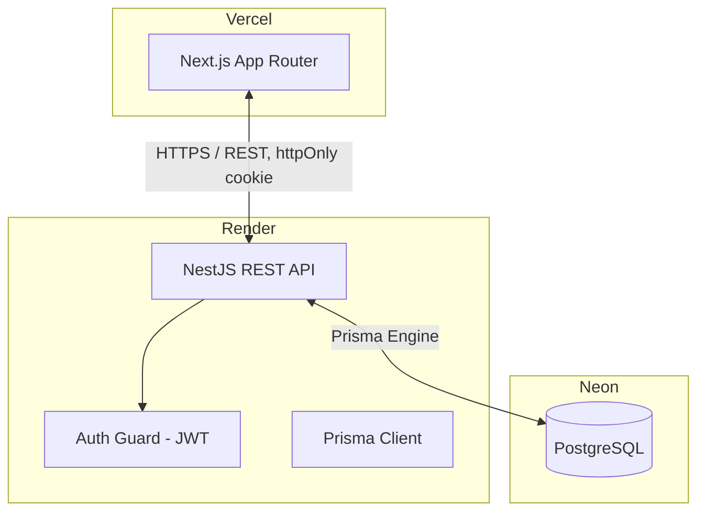

# Flowboard Architecture
> **Status: Skeleton.** Sections marked `TODO` will be filled in as each part is built. This file is written early and updated per commit so it stays accurate — not backfilled at the end.
This document provides a high-level overview of the architectural design, technologies, data flow, and design decisions for this project, built as the AbleSpace Full Stack Developer (Fresher) technical assessment.
## 1. High-Level System Architecture
The application follows a decoupled client-server architecture:
- **Frontend (Client):** A Next.js (App Router) application responsible for the UI, routing, task board/list views, theming, and client-side state.
- **Backend (Server):** A NestJS REST API responsible for authentication, task/project/subtask/comment CRUD, validation, and business logic.
- **Database Layer:** PostgreSQL, accessed via Prisma ORM for type-safe queries and migrations.
TODO: confirm this stays accurate once auth and data layers are actually wired up — update if anything deviates.
---
## 2. Technology Stack
### Client (Frontend)
- **Framework:** Next.js (App Router), TypeScript
- **Styling:** Tailwind CSS
- **State/Fetching:** Plain React state (`useState`/`useEffect`) + `fetch`, no external state or query library. Client components (`/tasks`, `/projects`, `/projects/:id`) fetch their own data on mount via `lib/api.ts`, which always calls relative `/api/*` paths (never the Render URL directly) so requests go through the same-origin rewrite proxy in `next.config.ts` — required for the session cookie to be visible cross-origin. Server components (the `(app)` layout's auth gate) use `lib/auth-server.ts` instead, which calls the absolute backend URL with a manually forwarded cookie header, since a server-side `fetch` never passes through the browser and can't use the relative-path rewrite. Board drag-and-drop and list/table edits update local state optimistically, then call the API and roll back on failure.
- **Column visibility ("Fields" dropdown, task list view):** kept in local component state (`useState<Set<string>>` in the Tasks/project-detail pages), not persisted anywhere — resets on reload or navigating away. Deliberately not a backend user preference; revisit if that's wanted later.
- **Theming:** Two independent axes — light/dark mode and accent color — persisted via `localStorage`, read pre-hydration to avoid flash of wrong theme
- **Deployment:** Vercel — https://flowboard-zeta-eight.vercel.app
### Server (Backend)
- **Framework:** NestJS, TypeScript
- **Validation:** `class-validator` + `class-transformer` DTOs on every route
- **Auth:** JWT in `httpOnly` cookie, guard applied globally except guest-login and health check
- **Deployment:** Render — https://flowboard-api-9074.onrender.com (`/health` confirmed live)
### Database Layer
- **Database:** PostgreSQL
- **ORM:** Prisma Client
- **Hosting:** Neon (serverless Postgres, permanent free tier — chosen over Render's managed Postgres, whose free tier expires 30 days after creation and wouldn't survive the assessment's review window)
---
## 3. Data Model
Implemented in [`backend/prisma/schema.prisma`](backend/prisma/schema.prisma). Summary below — treat the schema file as the source of truth if these ever drift. Migrated and live against the Neon database.
- **User** — id, email, name, avatar, isGuest, theme, accentColor
- **Project** — id, name, priority, leadId (→ User, nullable), dueDate. Deleting a project does **not** delete its tasks — Prisma's default `SET NULL` on the optional `Task.projectId` relation applies, so tasks survive and become unassigned rather than being destroyed. Verified live (Section 6 test pass), kept deliberately: task history shouldn't vanish because the project it was filed under got deleted.
- **Task** — id, title, description, status (`BACKLOG` / `TODO` / `DOING` / `COMPLETED` / `ON_HOLD`), priority (`NO_PRIORITY` / `URGENT` / `HIGH` / `MEDIUM` / `LOW`), assignees (↔ User, many-to-many), startDate, dueDate, projectId (nullable), labels (↔ Label, many-to-many)
- **Subtask** — same core fields as Task (including assignees, i.e. members — added after the initial draft, since the plan called for member support here too), parentTaskId (→ Task, cascade delete)
- **Comment** — taskId, authorId, body, createdAt
- **Label** — name (unique; seeded via [`backend/prisma/seed.ts`](backend/prisma/seed.ts): Research, Design, Development, Testing, Deployment — confirmed live in the Neon database)

Every route below runs through the global `AuthGuard` (Section 4) — all task/project data requires an authenticated session. DTOs use `class-validator` (enum checks on `status`/`priority`, string length limits, required-field checks) and reject invalid input with `400` before it reaches Prisma; foreign-key violations (bad `projectId`/`assigneeIds`/`labelIds`/`leadId`) are also caught and returned as clean `400`s rather than raw Prisma errors.
---
## 4. Data Flow & Communication
### API Communication
The Next.js client communicates with the NestJS backend via a RESTful JSON API. Auth is via `httpOnly` JWT cookie sent automatically with each request.
### Auth Flow
**Implemented and tested end-to-end** (guest path only — see Known Deviations, Section 7, for Google).
1. User lands on `/login`. Next.js `proxy.ts` (the App Router's request-interception layer — called `middleware` before Next.js 16) redirects any unauthenticated request for a non-`/login` route to `/login`, and redirects an already-authenticated visit to `/login` itself onward to `/tasks`. This check is presence-only (does the `flowboard_session` cookie exist) — it's a UX optimistic-redirect, not the security boundary, since the frontend has no way to verify the JWT signature without sharing the backend's secret.
2. Guest Login: client calls `POST /api/auth/guest`, backend finds-or-creates a single fixed demo `User` row (reused across every guest login, not one row per click), signs a JWT (`sub` = user id, 7-day expiry), and sets it as a cookie named `flowboard_session` — `httpOnly` always; `secure: true` + `sameSite: 'none'` in production (required for the cross-origin Vercel↔Render request), relaxed to `secure: false` + `sameSite: 'lax'` in local dev since Secure cookies are rejected over plain `http://localhost`.
3. Google Login: **stubbed, not implemented** — see Known Deviations (Section 7). Button is present in the UI to match the Figma design but is disabled.
4. All subsequent requests carry the cookie. A global `AuthGuard` (`APP_GUARD` in `app.module.ts`) verifies the JWT signature and loads the user from the DB on every route, except ones marked with the `@Public()` decorator (`/`, `/health`, `POST /api/auth/guest`, `POST /api/auth/logout`). This guard — not the frontend's presence check — is the actual security boundary.
5. `GET /api/auth/me` returns the authenticated user (via `@CurrentUser()`, populated by the guard). `POST /api/auth/logout` clears the cookie.
---
## 5. Infrastructure Diagram

TODO: this diagram is intentionally minimal for the skeleton stage — expand if any external services (e.g. file storage, email) get added.
---
## 6. API Reference
Keep this table accurate — it's the fastest way for an evaluator to understand scope without reading every controller. "Status" reflects what's actually deployed, not the plan.

### Auth
| Method | Path | Description | Auth | Status |
|--------|------|-------------|------|--------|
| POST | `/api/auth/guest` | Find-or-create the demo user, set session cookie | No | ✅ Implemented |
| POST | `/api/auth/logout` | Clear session cookie | No | ✅ Implemented |
| GET | `/api/auth/me` | Get current user from the session cookie | Cookie | ✅ Implemented |

### Projects
| Method | Path | Description | Auth | Status |
|--------|------|-------------|------|--------|
| GET | `/api/projects` | List projects | Cookie | ✅ Implemented |
| POST | `/api/projects` | Create project | Cookie | ✅ Implemented |
| GET | `/api/projects/:id` | Get one project | Cookie | ✅ Implemented |
| PATCH | `/api/projects/:id` | Update project | Cookie | ✅ Implemented |
| DELETE | `/api/projects/:id` | Delete project | Cookie | ✅ Implemented |
| GET | `/api/projects/:id/tasks` | Tasks for this project, grouped by status column (Figma "Projects > Design Homepage" breadcrumb view) | Cookie | ✅ Implemented |
| POST | `/api/projects/:id/tasks` | Create a task under this project | Cookie | ✅ Implemented |

### Tasks
| Method | Path | Description | Auth | Status |
|--------|------|-------------|------|--------|
| GET | `/api/tasks` | List tasks. Filters via query params: `projectId`, `assigneeId`, `status`, `priority` | Cookie | ✅ Implemented |
| POST | `/api/tasks` | Create task (`projectId` optional — unassigned tasks allowed) | Cookie | ✅ Implemented |
| GET | `/api/tasks/:id` | Get one task, with project/assignees/labels/subtasks/comments | Cookie | ✅ Implemented |
| PATCH | `/api/tasks/:id` | Update task (full edit surface, including status) | Cookie | ✅ Implemented |
| PATCH | `/api/tasks/:id/status` | Move task to a new status — dedicated minimal-payload endpoint for board drag-and-drop | Cookie | ✅ Implemented |
| DELETE | `/api/tasks/:id` | Delete task (cascades subtasks and comments) | Cookie | ✅ Implemented |

### Subtasks (nested under Task)
| Method | Path | Description | Auth | Status |
|--------|------|-------------|------|--------|
| GET | `/api/tasks/:taskId/subtasks` | List subtasks for a task | Cookie | ✅ Implemented |
| POST | `/api/tasks/:taskId/subtasks` | Add subtask | Cookie | ✅ Implemented |
| GET | `/api/tasks/:taskId/subtasks/:id` | Get one subtask | Cookie | ✅ Implemented |
| PATCH | `/api/tasks/:taskId/subtasks/:id` | Update subtask | Cookie | ✅ Implemented |
| DELETE | `/api/tasks/:taskId/subtasks/:id` | Delete subtask | Cookie | ✅ Implemented |

### Comments (nested under Task)
| Method | Path | Description | Auth | Status |
|--------|------|-------------|------|--------|
| GET | `/api/tasks/:taskId/comments` | List comments, ordered by `createdAt` ascending | Cookie | ✅ Implemented |
| POST | `/api/tasks/:taskId/comments` | Add comment (author = current session user) | Cookie | ✅ Implemented |

### Labels
| Method | Path | Description | Auth | Status |
|--------|------|-------------|------|--------|
| GET | `/api/labels` | List labels | Cookie | ✅ Implemented |
| POST | `/api/labels` | Create label | Cookie | ✅ Implemented |
| GET | `/api/labels/:id` | Get one label | Cookie | ✅ Implemented |
| PATCH | `/api/labels/:id` | Update label | Cookie | ✅ Implemented |
| DELETE | `/api/labels/:id` | Delete label | Cookie | ✅ Implemented |

TODO: no frontend UI consumes these yet (board/list views, task detail panel) — routes are built and tested against the live Neon database, not wired into pages.
---
## 7. Known Deviations from the Figma Design
Documented as they're made, not reconstructed from memory at submission time.
- Confirmed: Backlog status — the Figma task detail panel shows a "Backlog" status not present as a Kanban column. Board now built: `BOARD_STATUSES` (`frontend/src/lib/types.ts`) excludes `BACKLOG`, so backlog tasks don't render as a column. They do still appear in the List view, which groups by every status — list and board intentionally show a different status set.
- Confirmed: the `/login` page's "Login with Google" button is present but disabled (`aria-disabled`, no click handler) — full OAuth setup was out of scope given the assessment timeline. Guest Login (`POST /api/auth/guest`) is the fully functional, tested auth path.
- Confirmed: the task list view's "Fields" dropdown includes a toggleable "Reporter" column (per Figma) even though the data model has no `reporter`/`createdBy` field on `Task` — it renders as a placeholder (`—`) rather than being silently dropped. Adding real reporter tracking would need a schema change, out of scope for this pass.
- TODO: add any further deviations here as they come up during the build. Don't skip this — it's an explicit grading criterion.
---
## 8. Testing Strategy
TODO — not yet implemented. Plan:
- Backend: unit tests for guards and validation pipes, integration tests for auth-protected routes (Jest + Supertest, following the pattern used in Task-Flow's `export.test.js`).
- Frontend: TODO, decide scope given time budget.
---
## 9. Known Limitations
Being upfront about what this doesn't do, same as any real project:
- TODO: fill in honestly at the end. Likely candidates: no automated frontend tests given the 14-day window, Google OAuth is a stub not a working integration, no CI pipeline unless time allows.
