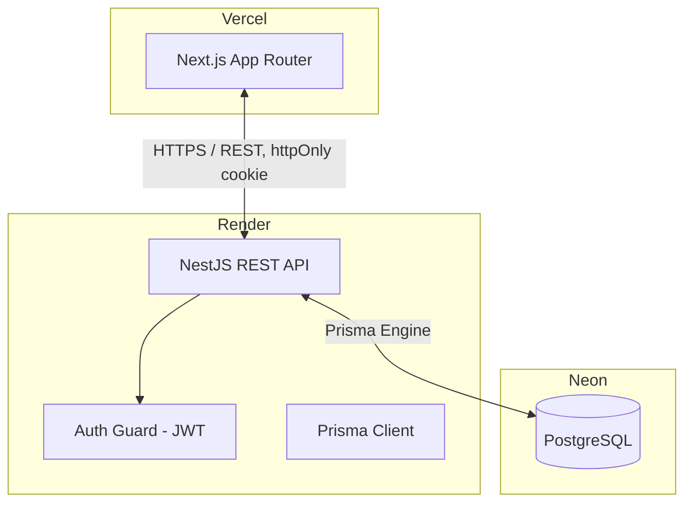

# Flowboard Architecture
> **Status: Skeleton.** Sections marked `TODO` will be filled in as each part is built. This file is written early and updated per commit so it stays accurate — not backfilled at the end.
This document provides a high-level overview of the architectural design, technologies, data flow, and design decisions for this project, built as the AbleSpace Full Stack Developer (Fresher) technical assessment.
## 1. High-Level System Architecture
The application follows a decoupled client-server architecture:
- **Frontend (Client):** A Next.js (App Router) application responsible for the UI, routing, task board/list views, theming, and client-side state.
- **Backend (Server):** A NestJS REST API responsible for authentication, task/project/subtask/comment CRUD, validation, and business logic.
- **Database Layer:** PostgreSQL, accessed via Prisma ORM for type-safe queries and migrations.
TODO: confirm this stays accurate once auth and data layers are actually wired up — update if anything deviates.
---
## 2. Technology Stack
### Client (Frontend)
- **Framework:** Next.js (App Router), TypeScript
- **Styling:** Tailwind CSS
- **State/Fetching:** TODO — decide and document (React Context, or a fetch/query library)
- **Theming:** Two independent axes — light/dark mode and accent color — persisted via `localStorage`, read pre-hydration to avoid flash of wrong theme
- **Deployment:** Vercel — https://flowboard-zeta-eight.vercel.app
### Server (Backend)
- **Framework:** NestJS, TypeScript
- **Validation:** `class-validator` + `class-transformer` DTOs on every route
- **Auth:** JWT in `httpOnly` cookie, guard applied globally except guest-login and health check
- **Deployment:** Render — https://flowboard-api-9074.onrender.com (`/health` confirmed live)
### Database Layer
- **Database:** PostgreSQL
- **ORM:** Prisma Client
- **Hosting:** Neon (serverless Postgres, permanent free tier — chosen over Render's managed Postgres, whose free tier expires 30 days after creation and wouldn't survive the assessment's review window)
---
## 3. Data Model
Implemented in [`backend/prisma/schema.prisma`](backend/prisma/schema.prisma). Summary below — treat the schema file as the source of truth if these ever drift.
- **User** — id, email, name, avatar, isGuest, theme, accentColor
- **Project** — id, name, priority, leadId (→ User, nullable), dueDate
- **Task** — id, title, description, status (`BACKLOG` / `TODO` / `DOING` / `COMPLETED` / `ON_HOLD`), priority (`NO_PRIORITY` / `URGENT` / `HIGH` / `MEDIUM` / `LOW`), assignees (↔ User, many-to-many), startDate, dueDate, projectId (nullable), labels (↔ Label, many-to-many)
- **Subtask** — same core fields as Task, parentTaskId (→ Task, cascade delete)
- **Comment** — taskId, authorId, body, createdAt
- **Label** — name (unique; seeded via [`backend/prisma/seed.ts`](backend/prisma/seed.ts): Research, Design, Development, Testing, Deployment)

No migrations have been run against a real database yet (schema is validated and the client generates cleanly). `prisma migrate dev` runs once a `DATABASE_URL` is provisioned.
---
## 4. Data Flow & Communication
### API Communication
The Next.js client communicates with the NestJS backend via a RESTful JSON API. Auth is via `httpOnly` JWT cookie sent automatically with each request.
### Auth Flow
**Implemented and tested end-to-end** (guest path only — see Known Deviations, Section 7, for Google).
1. User lands on `/login`. Next.js `proxy.ts` (the App Router's request-interception layer — called `middleware` before Next.js 16) redirects any unauthenticated request for a non-`/login` route to `/login`, and redirects an already-authenticated visit to `/login` itself onward to `/tasks`. This check is presence-only (does the `flowboard_session` cookie exist) — it's a UX optimistic-redirect, not the security boundary, since the frontend has no way to verify the JWT signature without sharing the backend's secret.
2. Guest Login: client calls `POST /api/auth/guest`, backend finds-or-creates a single fixed demo `User` row (reused across every guest login, not one row per click), signs a JWT (`sub` = user id, 7-day expiry), and sets it as a cookie named `flowboard_session` — `httpOnly` always; `secure: true` + `sameSite: 'none'` in production (required for the cross-origin Vercel↔Render request), relaxed to `secure: false` + `sameSite: 'lax'` in local dev since Secure cookies are rejected over plain `http://localhost`.
3. Google Login: **stubbed, not implemented** — see Known Deviations (Section 7). Button is present in the UI to match the Figma design but is disabled.
4. All subsequent requests carry the cookie. A global `AuthGuard` (`APP_GUARD` in `app.module.ts`) verifies the JWT signature and loads the user from the DB on every route, except ones marked with the `@Public()` decorator (`/`, `/health`, `POST /api/auth/guest`, `POST /api/auth/logout`). This guard — not the frontend's presence check — is the actual security boundary.
5. `GET /api/auth/me` returns the authenticated user (via `@CurrentUser()`, populated by the guard). `POST /api/auth/logout` clears the cookie.
---
## 5. Infrastructure Diagram

TODO: this diagram is intentionally minimal for the skeleton stage — expand if any external services (e.g. file storage, email) get added.
---
## 6. API Reference
TODO: fill in as each module is built. Keep this table accurate — it's the fastest way for an evaluator to understand scope without reading every controller. "Status" reflects what's actually deployed, not the plan.
| Method | Path | Description | Auth | Status |
|--------|------|-------------|------|--------|
| POST | `/api/auth/guest` | Find-or-create the demo user, set session cookie | No | ✅ Implemented |
| POST | `/api/auth/logout` | Clear session cookie | No | ✅ Implemented |
| GET | `/api/auth/me` | Get current user from the session cookie | Cookie | ✅ Implemented |
| GET | `/api/projects` | List projects | ✅ | TODO |
| POST | `/api/projects` | Create project | ✅ | TODO |
| GET | `/api/projects/:id/tasks` | List tasks grouped by status | ✅ | TODO |
| POST | `/api/projects/:id/tasks` | Create task | ✅ | TODO |
| PATCH | `/api/tasks/:id` | Update task (incl. status move) | ✅ | TODO |
| POST | `/api/tasks/:id/subtasks` | Add subtask | ✅ | TODO |
| POST | `/api/tasks/:id/comments` | Add comment | ✅ | TODO |
---
## 7. Known Deviations from the Figma Design
Documented as they're made, not reconstructed from memory at submission time.
- TODO: Backlog status — the Figma task detail panel shows a "Backlog" status not present as a Kanban column. Assumption: Backlog tasks exist pre-board and don't render until moved to a column. [Confirm or revise once board is built.]
- Confirmed: the `/login` page's "Login with Google" button is present but disabled (`aria-disabled`, no click handler) — full OAuth setup was out of scope given the assessment timeline. Guest Login (`POST /api/auth/guest`) is the fully functional, tested auth path.
- TODO: add any further deviations here as they come up during the build. Don't skip this — it's an explicit grading criterion.
---
## 8. Testing Strategy
TODO — not yet implemented. Plan:
- Backend: unit tests for guards and validation pipes, integration tests for auth-protected routes (Jest + Supertest, following the pattern used in Task-Flow's `export.test.js`).
- Frontend: TODO, decide scope given time budget.
---
## 9. Known Limitations
Being upfront about what this doesn't do, same as any real project:
- TODO: fill in honestly at the end. Likely candidates: no automated frontend tests given the 14-day window, Google OAuth is a stub not a working integration, no CI pipeline unless time allows.
