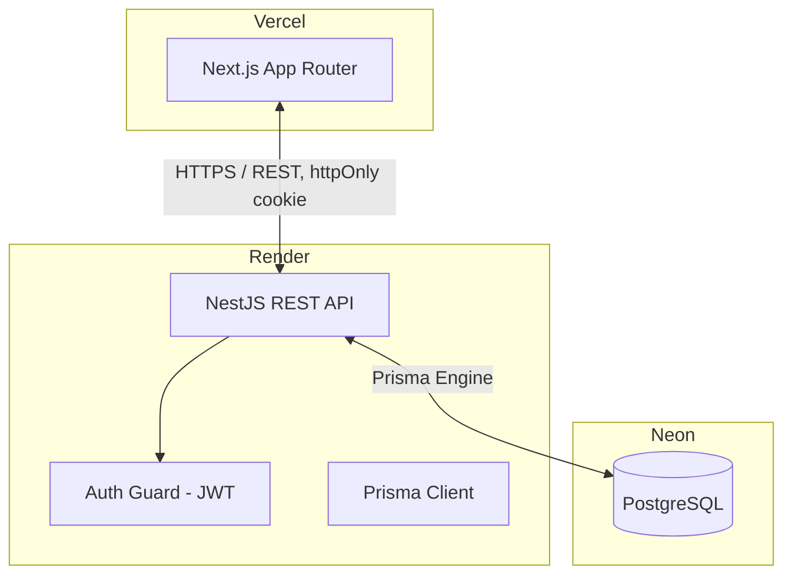

# Flowboard Architecture
This document covers the architectural design, technologies, data flow, and decisions behind Flowboard, built as the AbleSpace Full Stack Developer (Fresher) technical assessment. Written and updated alongside the build, not filled in afterward.
## 1. High-Level System Architecture
The application follows a decoupled client-server architecture:
- **Frontend (Client):** A Next.js (App Router) application responsible for the UI, routing, task board/list views, theming, and client-side state.
- **Backend (Server):** A NestJS REST API responsible for authentication, task/project/subtask/comment CRUD, validation, and business logic.
- **Database Layer:** PostgreSQL, accessed via Prisma ORM for type-safe queries and migrations.
---
## 2. Technology Stack
### Client (Frontend)
- **Framework:** Next.js (App Router), TypeScript
- **Styling:** Tailwind CSS
- **State/Fetching:** Plain React state (`useState`/`useEffect`) + `fetch`, no external state or query library. Client components (`/tasks`, `/projects`, `/projects/:id`) fetch their own data on mount via `lib/api.ts`, which always calls relative `/api/*` paths (never the Render URL directly) so requests go through the same-origin rewrite proxy in `next.config.ts` — required for the session cookie to be visible cross-origin. Server components (the `(app)` layout's auth gate) use `lib/auth-server.ts` instead, which calls the absolute backend URL with a manually forwarded cookie header, since a server-side `fetch` never passes through the browser and can't use the relative-path rewrite. Board drag-and-drop and list/table edits update local state optimistically, then call the API and roll back on failure.
- **"Fields" dropdown (`components/shared/fields-dropdown.tsx`):** two interactions in one control, per the Figma. Plain fields (Members, Due Date, Labels, Reporter) are checkboxes toggling column visibility — kept in local component state (`useState<Set<string>>` in the Tasks/project-detail pages). Status and Priority instead open a nested submenu of their actual values (`TASK_FILTER_FIELDS`/`PROJECT_FILTER_FIELDS`) with a checkmark on the active one; selecting a value filters the visible rows client-side, re-selecting it clears the filter. Neither the column-visibility state nor the row filters are persisted anywhere — both reset on reload or navigating away. Applies to the Tasks page (board and list) and the Projects list; Priority-only on Projects since `Project` has no `status` field.
- **Theming:** Two independent axes, never conflated into one switch:
  - **Light/Dark** ("Change Theme"): [`next-themes`](https://github.com/pacocoursey/next-themes), `attribute="class"` — toggles `.dark` on `<html>`. Tailwind v4 has no `tailwind.config.js` here, so `dark:` utilities needed a `@custom-variant dark (&:where(.dark, .dark *));` in `globals.css` to follow that class instead of `prefers-color-scheme`; without it, the manual toggle would silently do nothing. next-themes injects its own blocking anti-flash script at the top of `<body>`; `<html suppressHydrationWarning>` is required since that script mutates the DOM before React hydrates.
  - **Accent color** ("Color Mode": Amber / Blue / Pink / Rose / Emerald / Black): not next-themes' concern — a `[data-accent]` attribute on `<html>` driving a `--accent` / `--accent-foreground` CSS custom property pair (`globals.css`), exposed as Tailwind utilities (`bg-accent`, `text-accent-foreground`, …) via `@theme inline`. Persisted to `localStorage` (`flowboard:accent`) independently of the theme key next-themes uses. Own hand-written blocking `<script>` in `layout.tsx`'s `<head>` (`lib/theme.ts`'s `ACCENT_INIT_SCRIPT`) mirrors next-themes' pre-hydration approach, since next-themes only knows about its own light/dark key.
  - All primary buttons, the active nav/board-toggle state, and the priority-`URGENT` dot reference `--accent` — audited and fixed away from a previously-hardcoded `bg-black dark:bg-white` pattern. Other priority levels and status dots keep fixed semantic colors on purpose (all five priorities shifting with the user's accent choice would make them harder to tell apart, not easier).
  - Real user menu (`components/layout/user-menu.tsx`, replacing the earlier stub button) — avatar/name/email header, Change Theme and Color Mode as Radix submenus with a checkmark on the active value, Settings link.
- **Deployment:** Vercel — https://flowboard-zeta-eight.vercel.app
### Server (Backend)
- **Framework:** NestJS, TypeScript
- **Validation:** `class-validator` + `class-transformer` DTOs on every route
- **Auth:** JWT in `httpOnly` cookie, guard applied globally except guest-login and health check
- **Deployment:** Render — https://flowboard-api-9074.onrender.com (`/health` confirmed live)
### Database Layer
- **Database:** PostgreSQL
- **ORM:** Prisma Client
- **Hosting:** Neon (serverless Postgres, permanent free tier — chosen over Render's managed Postgres, whose free tier expires 30 days after creation and wouldn't survive the assessment's review window)
---
## 3. Data Model
Implemented in [`backend/prisma/schema.prisma`](backend/prisma/schema.prisma). Summary below — treat the schema file as the source of truth if these ever drift. Migrated and live against the Neon database.
- **User** — id, email, name, avatar, isGuest, theme, accentColor
- **Project** — id, name, priority, leadId (→ User, nullable), dueDate. Deleting a project does **not** delete its tasks — Prisma's default `SET NULL` on the optional `Task.projectId` relation applies, so tasks survive and become unassigned rather than being destroyed. Verified live (Section 6 test pass), kept deliberately: task history shouldn't vanish because the project it was filed under got deleted.
- **Task** — id, title, description, status (`BACKLOG` / `TODO` / `DOING` / `COMPLETED` / `ON_HOLD`), priority (`NO_PRIORITY` / `URGENT` / `HIGH` / `MEDIUM` / `LOW`), assignees (↔ User, many-to-many), startDate, dueDate, resourceUrl (nullable — single document/link field for the detail page's Resources row; no file upload, no multiple resources by design), projectId (nullable), labels (↔ Label, many-to-many)
- **Subtask** — same core fields as Task (including assignees, i.e. members — added after the initial draft, since the plan called for member support here too), parentTaskId (→ Task, cascade delete)
- **Comment** — taskId, authorId, body, createdAt
- **TaskActivity** — id, field, oldValue, newValue, createdAt, taskId (→ Task, cascade delete). Powers the task detail page's "Updates" panel. Written server-side only, by `TasksService`, only for `status` / `priority` / `startDate` / `dueDate` / `assignee` changes (matches what the Figma's Updates panel actually shows — not every editable field). No actor/user field: with only the single reused guest account in this app, "who changed it" wouldn't add information yet.
- **Label** — name (unique; seeded via [`backend/prisma/seed.ts`](backend/prisma/seed.ts): Research, Design, Development, Testing, Deployment — confirmed live in the Neon database)

Every route below runs through the global `AuthGuard` (Section 4) — all task/project data requires an authenticated session. DTOs use `class-validator` (enum checks on `status`/`priority`, string length limits, required-field checks) and reject invalid input with `400` before it reaches Prisma; foreign-key violations (bad `projectId`/`assigneeIds`/`labelIds`/`leadId`) are also caught and returned as clean `400`s rather than raw Prisma errors.
---
## 4. Data Flow & Communication
### API Communication
The Next.js client communicates with the NestJS backend via a RESTful JSON API. Auth is via `httpOnly` JWT cookie sent automatically with each request.
### Auth Flow
**Implemented and tested end-to-end** (guest path only — see Known Deviations, Section 7, for Google).
1. User lands on `/login`. Next.js `proxy.ts` (the App Router's request-interception layer — called `middleware` before Next.js 16) redirects any unauthenticated request for a non-`/login` route to `/login`, and redirects an already-authenticated visit to `/login` itself onward to `/tasks`. This check is presence-only (does the `flowboard_session` cookie exist) — it's a UX optimistic-redirect, not the security boundary, since the frontend has no way to verify the JWT signature without sharing the backend's secret.
2. Guest Login: client calls `POST /api/auth/guest`, backend finds-or-creates a single fixed demo `User` row (reused across every guest login, not one row per click), signs a JWT (`sub` = user id, 7-day expiry), and sets it as a cookie named `flowboard_session` — `httpOnly` always; `secure: true` + `sameSite: 'none'` in production (required for the cross-origin Vercel↔Render request), relaxed to `secure: false` + `sameSite: 'lax'` in local dev since Secure cookies are rejected over plain `http://localhost`.
3. Google Login: **stubbed, not implemented** — see Known Deviations (Section 7). Button is present in the UI to match the Figma design but is disabled.
4. All subsequent requests carry the cookie. A global `AuthGuard` (`APP_GUARD` in `app.module.ts`) verifies the JWT signature and loads the user from the DB on every route, except ones marked with the `@Public()` decorator (`/`, `/health`, `POST /api/auth/guest`, `POST /api/auth/logout`). This guard — not the frontend's presence check — is the actual security boundary.
5. `GET /api/auth/me` returns the authenticated user (via `@CurrentUser()`, populated by the guard). `POST /api/auth/logout` clears the cookie.
---
## 5. Infrastructure Diagram

No file storage or email service was ever added, so this stays the complete picture: three services, nothing else in the request path.
---
## 6. API Reference
Keep this table accurate — it's the fastest way for an evaluator to understand scope without reading every controller. "Status" reflects what's actually deployed, not the plan.

### Auth
| Method | Path | Description | Auth | Status |
|--------|------|-------------|------|--------|
| POST | `/api/auth/guest` | Find-or-create the demo user, set session cookie | No | ✅ Implemented |
| POST | `/api/auth/logout` | Clear session cookie | No | ✅ Implemented |
| GET | `/api/auth/me` | Get current user from the session cookie | Cookie | ✅ Implemented |

### Projects
| Method | Path | Description | Auth | Status |
|--------|------|-------------|------|--------|
| GET | `/api/projects` | List projects | Cookie | ✅ Implemented |
| POST | `/api/projects` | Create project | Cookie | ✅ Implemented |
| GET | `/api/projects/:id` | Get one project | Cookie | ✅ Implemented |
| PATCH | `/api/projects/:id` | Update project | Cookie | ✅ Implemented |
| DELETE | `/api/projects/:id` | Delete project | Cookie | ✅ Implemented |
| GET | `/api/projects/:id/tasks` | Tasks for this project, grouped by status column (Figma "Projects > Design Homepage" breadcrumb view) | Cookie | ✅ Implemented |
| POST | `/api/projects/:id/tasks` | Create a task under this project | Cookie | ✅ Implemented |

### Tasks
| Method | Path | Description | Auth | Status |
|--------|------|-------------|------|--------|
| GET | `/api/tasks` | List tasks. Filters via query params: `projectId`, `assigneeId`, `status`, `priority` | Cookie | ✅ Implemented |
| POST | `/api/tasks` | Create task (`projectId` optional — unassigned tasks allowed) | Cookie | ✅ Implemented |
| GET | `/api/tasks/:id` | Get one task, with project/assignees/labels/subtasks/comments | Cookie | ✅ Implemented |
| PATCH | `/api/tasks/:id` | Update task (full edit surface, including status) | Cookie | ✅ Implemented |
| PATCH | `/api/tasks/:id/status` | Move task to a new status — dedicated minimal-payload endpoint for board drag-and-drop | Cookie | ✅ Implemented |
| DELETE | `/api/tasks/:id` | Delete task (cascades subtasks and comments) | Cookie | ✅ Implemented |
| GET | `/api/tasks/:id/activity` | List activity log entries for the task's "Updates" panel, newest first | Cookie | ✅ Implemented |

### Subtasks (nested under Task)
| Method | Path | Description | Auth | Status |
|--------|------|-------------|------|--------|
| GET | `/api/tasks/:taskId/subtasks` | List subtasks for a task | Cookie | ✅ Implemented |
| POST | `/api/tasks/:taskId/subtasks` | Add subtask | Cookie | ✅ Implemented |
| GET | `/api/tasks/:taskId/subtasks/:id` | Get one subtask | Cookie | ✅ Implemented |
| PATCH | `/api/tasks/:taskId/subtasks/:id` | Update subtask | Cookie | ✅ Implemented |
| DELETE | `/api/tasks/:taskId/subtasks/:id` | Delete subtask | Cookie | ✅ Implemented |

### Comments (nested under Task)
| Method | Path | Description | Auth | Status |
|--------|------|-------------|------|--------|
| GET | `/api/tasks/:taskId/comments` | List comments, ordered by `createdAt` ascending | Cookie | ✅ Implemented |
| POST | `/api/tasks/:taskId/comments` | Add comment (author = current session user) | Cookie | ✅ Implemented |

### Labels
| Method | Path | Description | Auth | Status |
|--------|------|-------------|------|--------|
| GET | `/api/labels` | List labels | Cookie | ✅ Implemented |
| POST | `/api/labels` | Create label | Cookie | ✅ Implemented |
| GET | `/api/labels/:id` | Get one label | Cookie | ✅ Implemented |
| PATCH | `/api/labels/:id` | Update label | Cookie | ✅ Implemented |
| DELETE | `/api/labels/:id` | Delete label | Cookie | ✅ Implemented |

`GET /api/labels` is consumed by the label picker (task detail page and its Details sidebar) to list the available labels; assigning one to a task goes through `PATCH /api/tasks/:id`'s `labelIds` field, not through these routes directly. `POST`/`PATCH`/`DELETE` here have no frontend trigger. There's no "create a new label" UI, only the five seeded labels are ever selectable. All five routes are still built and tested against the live Neon database.
---
## 7. Known Deviations from the Figma Design
Documented as they're made, not reconstructed from memory at submission time.
- Confirmed: Backlog status — the Figma task detail panel shows a "Backlog" status not present as a Kanban column. Board now built: `BOARD_STATUSES` (`frontend/src/lib/types.ts`) excludes `BACKLOG`, so backlog tasks don't render as a column. They do still appear in the List view, which groups by every status — list and board intentionally show a different status set.
- Confirmed: the `/login` page's "Login with Google" button is present but disabled (`aria-disabled`, no click handler) — full OAuth setup was out of scope given the assessment timeline. Guest Login (`POST /api/auth/guest`) is the fully functional, tested auth path.
- Confirmed: the task list view's "Fields" dropdown includes a toggleable "Reporter" column (per Figma) even though the data model has no `reporter`/`createdBy` field on `Task` — it renders as a placeholder (`—`) rather than being silently dropped. Adding real reporter tracking would need a schema change, out of scope for this pass.
- Confirmed: the task detail page's Details sidebar shows a "Reporter" field (same `—` placeholder gap as above) and a "Team" field — there's no `Team` model in the data layer, so `Team` displays the task's `project.name` as the closest existing equivalent (or `—` for unassigned tasks) rather than being dropped or fabricated.
- Confirmed: the `/settings` page's Profile section (avatar, email, name, title, username) is session-local by design — edits live in component state only and are never sent to the backend. The app has no real per-user accounts (guest login always resolves to the same shared demo `User` row), so persisting profile edits would mean one guest's changes overwrite another guest's session. Reloading the page or opening a new guest session resets these fields to defaults. Theme and Color Mode are the exception — those already persist (see Section 2) since they're cosmetic/device-local by design, not identity data. "Leave Workspace" on the same page is disabled for the same guest-mode reason, following the existing Google-login stub pattern.
- Confirmed: the funnel/filter icon shown next to "Fields" in the Figma toolbar has no prototyped interaction in the source file — no distinct panel or click behavior is defined for it there. Rather than invent behavior for it, it was left out of the built toolbar entirely (the "Fields" button itself already covers the real interaction: Status/Priority submenus filter rows, see below). If the Figma is ever updated with an intended behavior for it, revisit.
- Confirmed: the Fields dropdown's Status/Priority row-filtering (Tasks board/list, Projects list) is client-side only and intentionally not persisted — resets on navigation or reload, same as the existing column-visibility state it sits alongside (Section 2). Selecting an already-active filter value clears it; the Figma shows no separate "clear filter" control.
- Confirmed: the sidebar's mobile behavior (below 768px) is an off-canvas drawer opened by a hamburger button, not the desktop icon-collapse rail shrunk further. Desktop collapse is a standing user preference saved to `localStorage`. The mobile drawer is closed by default every time and has no such preference, since there's no room for a persistent icon rail at phone width.
---
## 8. Testing Strategy
Backend has real unit tests for the two places identified as highest-value: `CreateTaskDto` (`tasks/dto/create-task.dto.spec.ts`, using `class-validator`'s `validate()` directly, accepts valid payloads and rejects bad enums/UUIDs/dates) and `AuthGuard` (`auth/guards/auth.guard.spec.ts`, with `JwtService`/`PrismaService` mocked, covers the `@Public()` bypass, missing cookie, invalid JWT, and deleted-user cases). Both are pure logic with no database dependency, so they run fast and don't need a live Neon connection. `nest generate`'s two default spec files (`src/app.controller.spec.ts`, `test/app.e2e-spec.ts`) are still in the tree too, still testing the placeholder "Hello World" root route rather than anything Flowboard-specific, kept because they pass and cost nothing to leave in. Run with `npm test` and `npm run test:e2e` in `backend`. Frontend has no test files.

The rest of the backend (services, controllers, the actual CRUD routes) and all of the frontend were verified manually instead, feature by feature, before each merge to `main`: running the app locally against a live Neon connection, a curl round-trip against that live database after every schema migration rather than trusting Prisma's migrate output on its own, and a check against that feature branch's Vercel preview deploy before merging. Given more time, the tasks/projects/subtasks services (the actual write paths, currently only covered indirectly through manual testing) are the next place real Jest + Supertest integration tests would pay off.
---
## 9. Known Limitations
Being upfront about what this doesn't do, same as any real project:
- Automated test coverage is narrow: DTO validation and the auth guard on the backend, nothing else. Full detail in Section 8.
- Google login is a disabled stub, not a working OAuth integration (Section 7).
- No CI pipeline. Pushes to `main` trigger Vercel's and Render's own git-connected deploys directly; there's no automated lint/test/build gate in between beyond running those checks by hand before merging.
- Single shared guest account, not real multi-user support. Everyone using the live demo reads and writes the same tasks, projects, and comments at the same time. Task/project assignees always resolve to that one demo user, since there's no second account to assign anything to.
- No file upload. `resourceUrl` on a task is a plain link field, and profile avatars are an initials/color picker or a URL string, not a real upload pipeline.
- No realtime sync. If the same account is open in two tabs or two browsers, one won't see the other's changes until it reloads. There's no websocket or polling layer.
- No pagination on the list endpoints (`GET /api/tasks`, `GET /api/projects`). Fine at the data volumes this demo has, would need it before that data grew much further.
- Render's free tier spins the backend down after periods of inactivity, so the first request after a while can take up to about a minute while it cold-starts. That's a Render free-tier characteristic, not something the app itself does.
